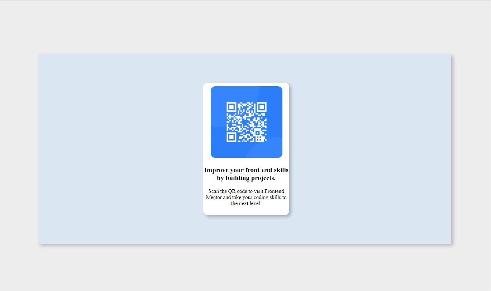

# Frontend Mentor - QR code component solution

This is a solution to the [QR code component challenge on Frontend Mentor](https://www.frontendmentor.io/challenges/qr-code-component-iux_sIO_H). Frontend Mentor challenges help you improve your coding skills by building realistic projects. 

## Table of contents

- [Overview](#overview)
  - [Screenshot](#screenshot)
  - [Built with](#built-with)
  - [Useful resources](#useful-resources)
- [Author](#author)

**Note: Delete this note and update the table of contents based on what sections you keep.**

## Overview

### Screenshot

### Built with

- Semantic HTML5 markup
- CSS custom properties

## Useful resources
- [W3 Schools](https://www.w3schools.com/) - This helped me for XYZ reason. I really liked this pattern and will use it going forward.

## Author

- Website - [Tanmay Uniyal](https://github.com/tanmayuniyal)
- Frontend Mentor - [@tanmayuniyal](https://www.frontendmentor.io/profile/tanmayuniyal)
